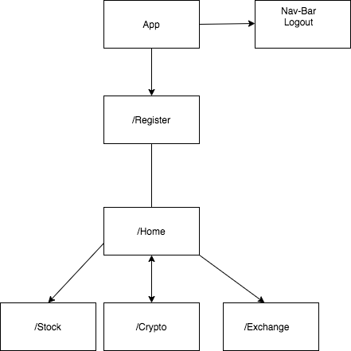

# _Stock-Capstone_

#### _React Webapplication. 3.05.2020_

#### By _** Jamila Aliyeva**_

## Description

## Description
- The user has to register for an account 
- The registered account gets saved onto Firebase database 
- Once the user has an accout they are able to navigate to:
### `Stock Chart`
### `Crypto Chart`
### `Exchange Rate` 
- In the stock and crypto chart the user will be able to select the tyoe of market they would like to view
- In the exchange rate the user wil be able to select currencies 
- Once the user is finished using the app they are able to log-out

##Component Tree

## Setup/Installation Requirements

### `npm install`
### `npm start`

## Known Bugs

_No known major bugs at this time._

## Support and contact details

_aliyeva852@gmail.com_

## Project Description 

###MVC: 
_User is able to view the data via graph_
_User is able to select the stock option_
_User is able to Zoom in on graph_ 
_Provides a UI_
_User Authentication_

###Time to spare: 
_Add a crypto currency  option_
_Create a very aesthetic product_ 
_Create authentication for user_  
_Subscribe to a curerncy/crypto_
_Donation Page_
_Host page on Firebase_

## Technologies Used

_React, Firebase, Node.js, Material UI _

### License

*The MIT license*

Copyright (c) 2020 **_ Jamila Aliyeva_**

Permission is hereby granted, free of charge, 
to any person obtaining a copy of this software and 
associated documentation files (the "Software"), to 
deal in the Software without restriction, including 
without limitation the rights to use, copy, modify, 
merge, publish, distribute, sublicense, and/or sell 
copies of the Software, and to permit persons to whom 
the Software is furnished to do so, 
subject to the following conditions:

The above copyright notice and this permission notice 
shall be included in all copies or substantial portions of the Software.

THE SOFTWARE IS PROVIDED "AS IS", WITHOUT WARRANTY OF ANY KIND, 
EXPRESS OR IMPLIED, INCLUDING BUT NOT LIMITED TO THE WARRANTIES 
OF MERCHANTABILITY, FITNESS FOR A PARTICULAR PURPOSE AND NONINFRINGEMENT. 
IN NO EVENT SHALL THE AUTHORS OR COPYRIGHT HOLDERS BE LIABLE FOR 
ANY CLAIM, DAMAGES OR OTHER LIABILITY, WHETHER IN AN ACTION OF CONTRACT, 
TORT OR OTHERWISE, ARISING FROM, OUT OF OR IN CONNECTION WITH THE 
SOFTWARE OR THE USE OR OTHER DEALINGS IN THE SOFTWARE.
 

